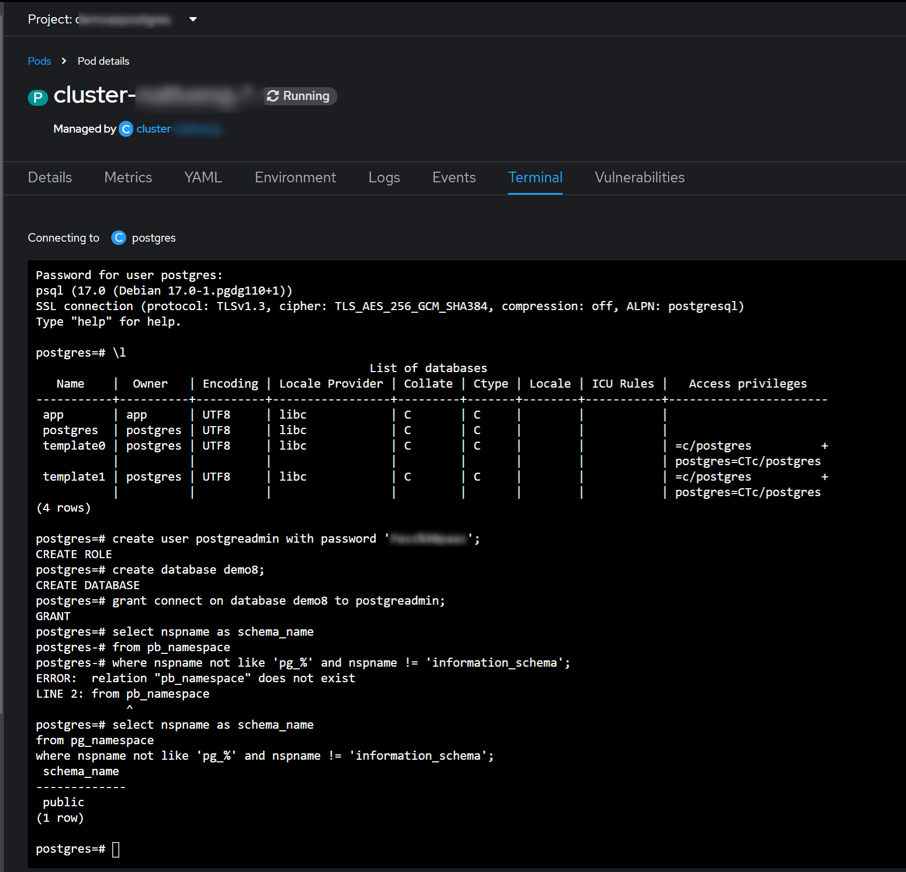
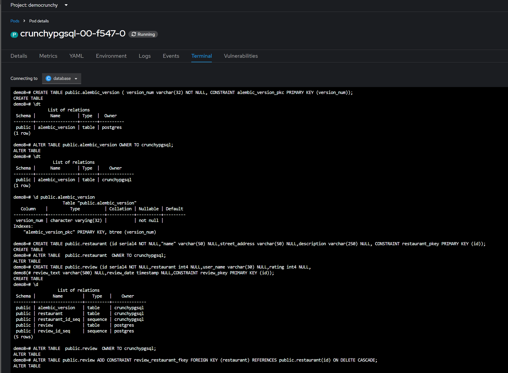
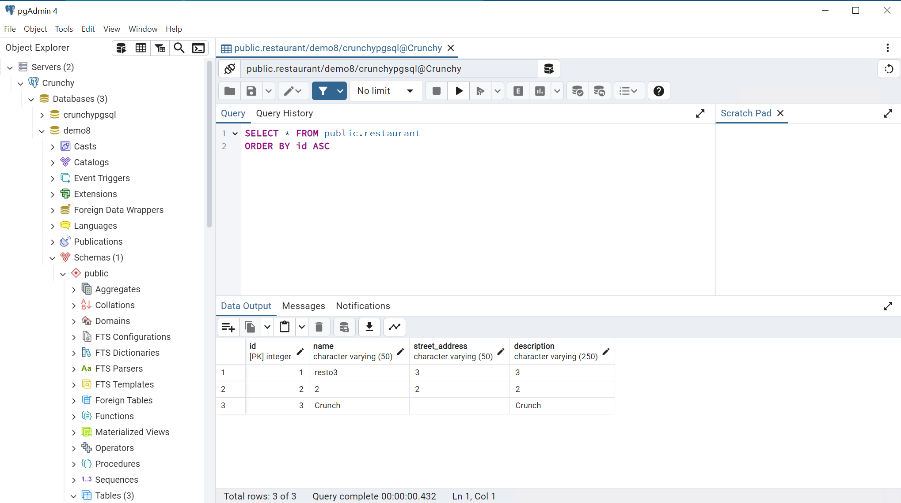

# Deploy PostgreSQL cluster via Crunchy Operator

## Requirements

The team has installed the operator and you can see it in "installed operators"
> More details can be found in the [official doc](https://access.crunchydata.com/documentation/postgres-operator/latest)

## Create Cluster
Once we have installed the operator, we proceed to create our PostGreSQL Cluster using the correspondant manifest file: 
* [See Manifest](base/crunchy.yaml)

Note that we also need to expose the cluster via a NodePort service in order to reach it form the outside world.

## Create database
We can directly use the terminal window available from the PaaS, to operate the cluster and create users and databases as needed:
```bash
psql -U postgres -h localhost
create user postgreadmin with password 'thepassword';
create database demo8;
grant connect on database demo8 to postgreadmin;

```


## Create Tables
And create the needed tables the same way


Altenatively, you can use the [Official tool PGAdmin](https://www.pgadmin.org/download/) to inject the required tables and manage the Databases in the cluster.



If we opt for this tool, we can easily use manifest files to deploy and expose the PGAdmin into the PaaS to the outside world
* [See Manifest](base/pgadmincrunchy.yaml)
