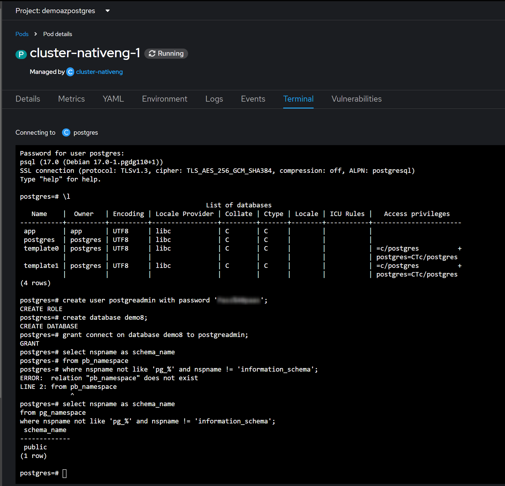
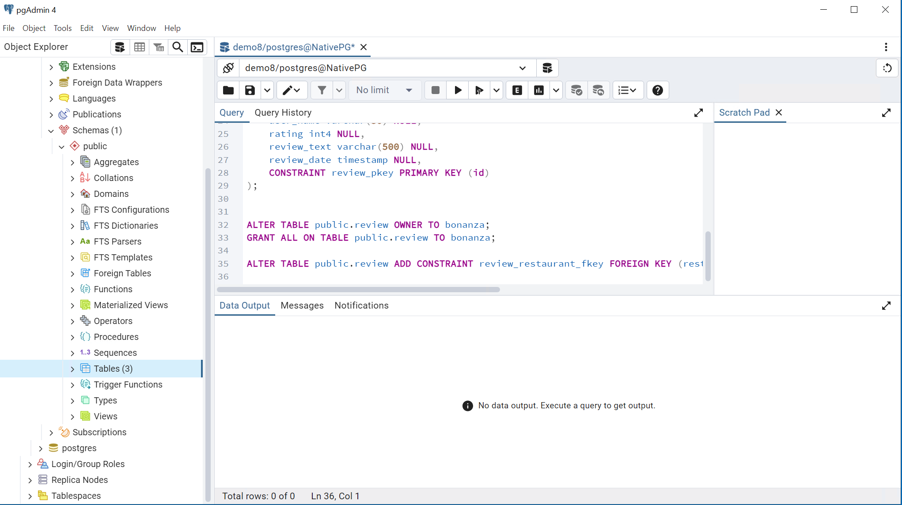

# Deploy PostgreSQL cluster via CloudNativePG Operator

## Requirements

The team has installed the operator and you can see it in "installed operators"
> More details can be found in the [official doc](https://cloudnative-pg.io/docs/)

### Create Cluster
Once we have installed the operator, we proceed to create our PostGreSQL Cluster using the correspondant manifest file: 
* [See Manifest](base/cluster-nativeng.yaml)

Note that we also need to expose the cluster via a NodePort service in order to reach it form the outside world.


### Create database
We can directly use the terminal window available from the PaaS, to operate the cluster and create users and databases as needed:
```bash
psql -U postgres -h localhost
any command
...
create user postgreadmin with password 'thepassword';
create database demo8;
grant connect on database demo8 to postgreadmin;
```


### Create Tables
And create the needed tables.
For example, you can use the [Official tool PGAdmin](https://www.pgadmin.org/download/) to inject the required tables;


If needed, PGAdmin tool gives access to the PostgreSQL cluster to create additional databases.
