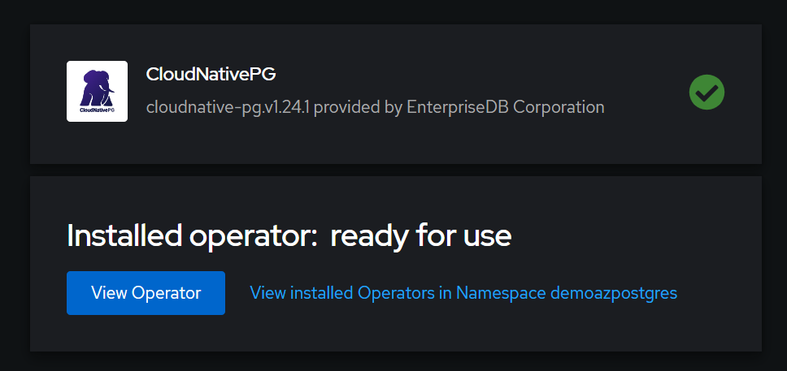
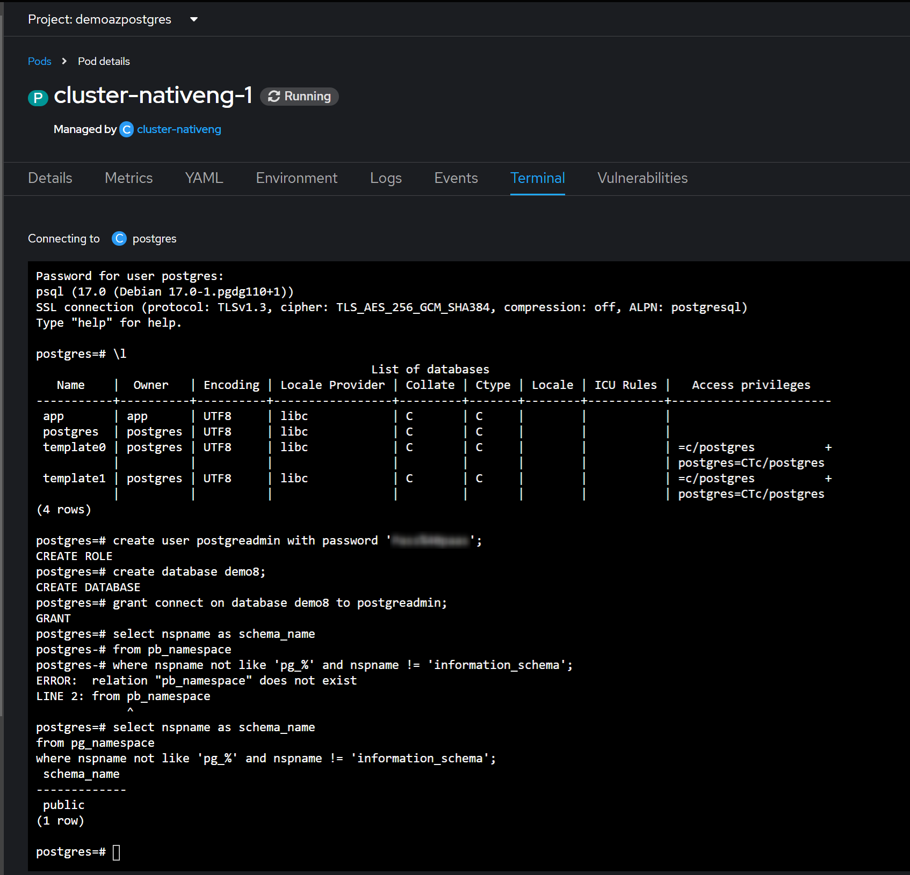
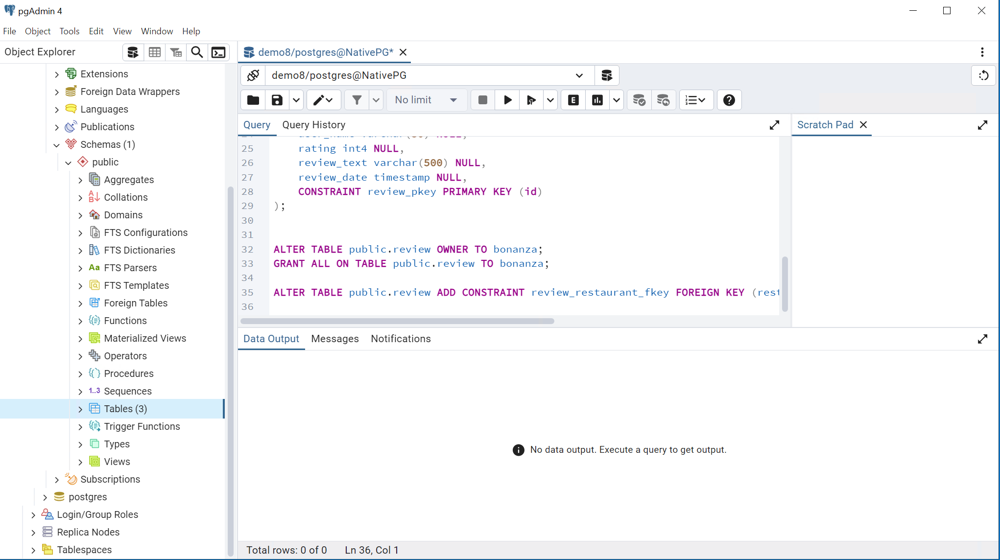
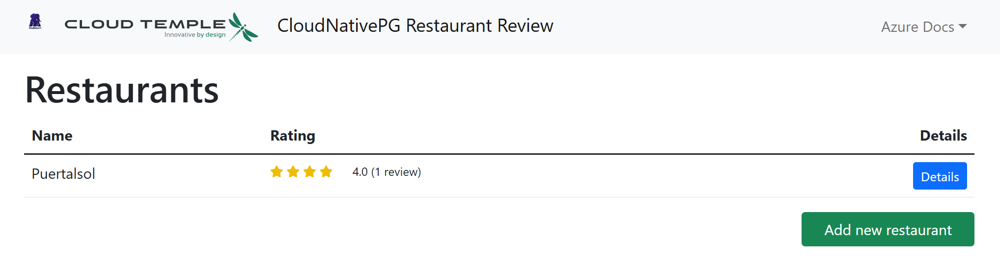

# Deploy a Python (Flask) web app with  Cloud NativePG PostgreSQL in PaaS

This is a Python web app using the Flask framework and the Cloud NativePG for PostgreSQL relational database. The Flask app is hosted in Openshift, as well as the accessed PostgreSQL cluster. The Flask app is hosted in Openshift, as well as the accessed PostgreSQL cluster. The packaged application is inspired by another one from Microsoft [here](https://learn.microsoft.com/en-us/samples/azure-samples/msdocs-flask-postgresql-sample-app/msdocs-flask-postgresql-sample-app/)


## Requirements

The [requirements.txt](./app/requirements.txt) has the following packages, all used by a typical data-driven Flask application:

| Package | Description |
| ------- | ----------- |
| [Flask](https://pypi.org/project/Flask/) | Web application framework. |
| [SQLAlchemy](https://pypi.org/project/SQLAlchemy/) | Provides a database abstraction layer to communicate with PostgreSQL. |
| [Flask-SQLAlchemy](https://pypi.org/project/Flask-SQLAlchemy/) | Adds SQLAlchemy support to Flask application by simplifying using SQLAlchemy. Requires SQLAlchemy. |
| [Flask-Migrate](https://pypi.org/project/Flask-Migrate/) | SQLAlchemy database migrations for Flask applications using Alembic. Allows functionality parity with Django version of this sample app.|
| [python-dotenv](https://pypi.org/project/python-dotenv/) | Read key-value pairs from .env file and set them as environment variables. In this sample app, those variables describe how to connect to the database. <br><br> Flask's [dotenv support](https://flask.palletsprojects.com/en/2.1.x/cli/#environment-variables-from-dotenv) sets environment variables automatically from an `.env` file. |
| [flask_wtf](https://pypi.org/project/Flask-WTF/) | Form rendering, validation, and CSRF protection for Flask with WTForms. Uses CSRFProtect extension. |

[pyscopg2](https://pypi.org/project/psycopg2/). this PostgreSQL database adapter for Python is installed from SO

> [!NOTE]  
>  Additionally, a PostgreSQL Cluster instance created via Cloud NativePG must previously be deployed in the PaaS. 
> 


### Create Cluster
Once we have installed the operator, we proceed to create our PostGreSQL Cluster using the correspondant manifest file: 
* [See Manifest](postgres-k8s-nativepg/base/cluster-nativeng.yaml)

Note that we also need to expose the cluster via a NodePort service in order to reach it form the outside world.


### Create database
We can directly use the terminal window available from the PaaS, to operate the cluster and create users and databases as needed:
```bash
psql -U postgres -h localhost
any command
...
create user postgreadmin with password 'thepassword';
create database demo8;
grant connect on database demo8 to postgreadmin;
```


### Create Tables
And create the needed tables.
For example, you can use the [Official tool PGAdmin](https://www.pgadmin.org/download/) to inject the required tables;


If needed, PGAdmin tool gives access to the PostgreSQL cluster to create additional databases.

## Deploy app
Upload to app image to the registry:
### Registry
#### URL To access the registry:
[https://registry-ocp01-{your-id}.paas.cloud-temple.com](https://registry-ocp01-{your-id}.paas.cloud-temple.com)
#### Log in:
```bash
oc login https://api-ocp01-{your-id}.paas.cloud-temple.com --web
docker login -u {your-user} -p $(oc whoami -t) registry-ocp01-{your-id}.paas.cloud-temple.com
# can be oc registry login
```
#### Build and push:
```bash
docker login -u {your-user} -p $(oc whoami -t) registry-ocp01-{your-id}.paas.cloud-temple.com
docker build -t registry-ocp01-{your-id}.paas.cloud-temple.com/{your-project}/oc_2_postgres-nativeng:latest .
docker push registry-ocp01-{your-id}.paas.cloud-temple.com/{your-project}/oc_2_postgres-nativeng:latest 
```
Here _"oc_2_postgres-nativeng"_ is the name of the image where the app is packaged.

Deploy needed secrets on openshift:
```shell
oc apply -f .\postgres-k8s\base\cluster-nativeng-secret.yaml
```
Deploy on openshift via deployment file:

```shell
oc apply -f .\postgres-k8s\base\postgreNativepg.yaml
```
#### CI pipeline
A CI pipeline should be set up based on repository activity on the designated branch, serving as a best practice for automating the build and upload of the application image to the registry. In our case, this pipeline is configured in Azure DevOps.

When it has finished deploying, you can visit the service URI, and you should see the front page of the restaurant review app! 🎉 



🎥 Watch
## Run the sample locally

1. In the terminal, run the following commands:

    ```shell
    # Install requirements
    pip install psycopg2-binary
    python3 -m pip install -r requirements.txt
    
    # Run database migrations
    python3 -m flask db upgrade
    # Start the development server
    python3 -m flask run
    ```
